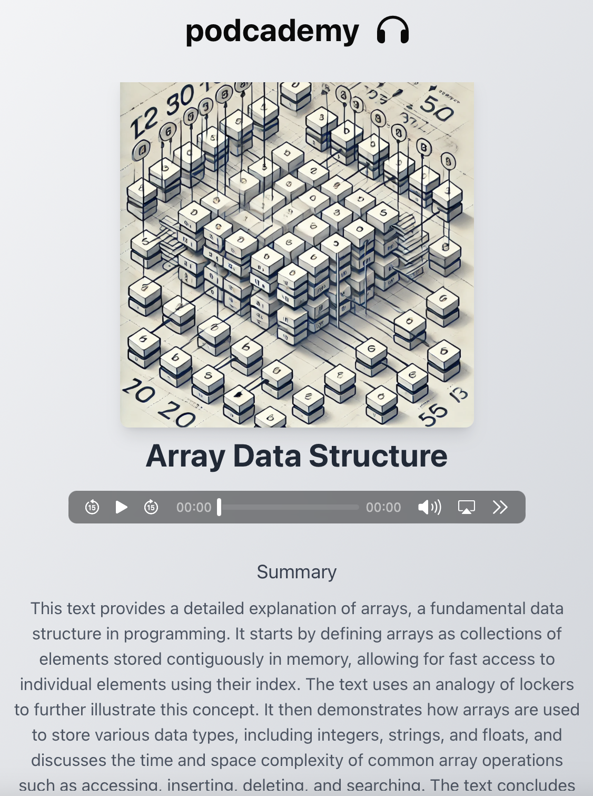

# Podcademy 🎧



### 🚀 Overview
Podcademy is a platform designed to transform your downtime into learning time by replacing mindless social media scrolling with engaging and educational podcast episodes.

### 🏆 Award
Winner of Best Use of Google NotebookLM at Columbia DivHacks!

### Built By
Daniel Chen, Evan Haque, Stella Tsogtjargal, and Emujin Tsogtjargal

## 🎯 Features
- **AI-Powered Recommendations:** Personalized podcast suggestions using Google NotebookLM.
- **Cross-Platform Accessibility:** Seamlessly access the platform from any device.
- **Modern UI:** Built with TailwindCSS for a responsive and sleek design.

## 🛠️ Tech Stack
- **Frontend:** React, TailwindCSS, TypeScript, Shadcn
- **Backend:** Flask, Python
- **Database:** Supabase
- **Cloud Services:** AWS
- **AI Integration:** Google NotebookLM

## How to Run

Frontend

```bash
cd react_s3_frontend
npm i
npm run dev
http://localhost:5173
```

Backend

```bash
cd flask_s3_backend
npm i
npm start
https://127.0.0.1:5000/
```
